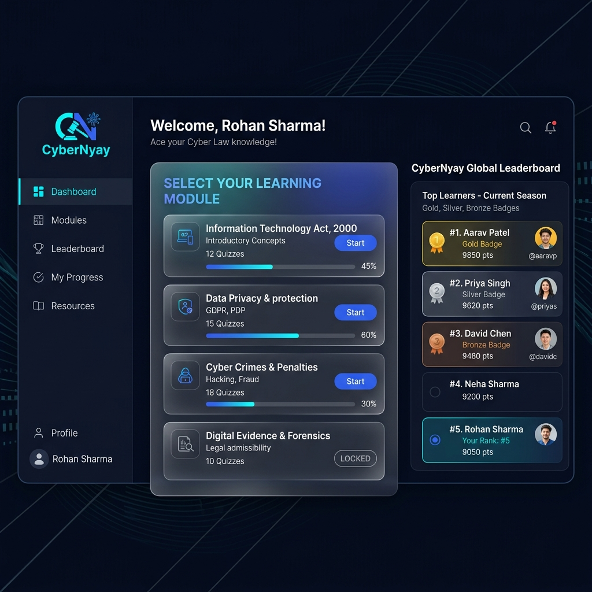

# CyberNyay - IT Act Quiz & Learning Platform

Welcome to the **CyberNyay**, an interactive and gamified platform designed to help students master the Information Technology Act, 2000. 



## Features
- **Comprehensive Coverage**: Covers all 6 units of the Cyber Law & Ethics syllabus.
- **Gamified Learning**: Earn XP, build streaks, and unlock badges.
- **Leaderboard**: Compete globally with other students.
- **Real-Time Feedback**: Immediate explanations and references to actual IT Act sections.

## Tech Stack
- **Frontend**: React.js, Vite, Tailwind CSS, Framer Motion
- **Backend**: Node.js, Express.js, JWT Authentication
- **Database**: MongoDB

## How to Run Locally

### 1. Database Setup
Create a `.env` file in the `backend/` directory:
```env
PORT=5000
MONGO_URI=mongodb+srv://<your-username>:<your-password>@cluster0.mongodb.net/itact_quiz
JWT_SECRET=supersecretjwtkey
```

### 2. Seed the Questions
Run the seed script to populate 60 IT Act questions:
```bash
cd backend
node seed/seedQuestions.js
```

### 3. Run Backend & Frontend
Start the Backend:
```bash
cd backend
npm run dev
```

Start the Frontend:
```bash
cd frontend
npm run dev
```

Visit `http://localhost:5173` to start learning!
